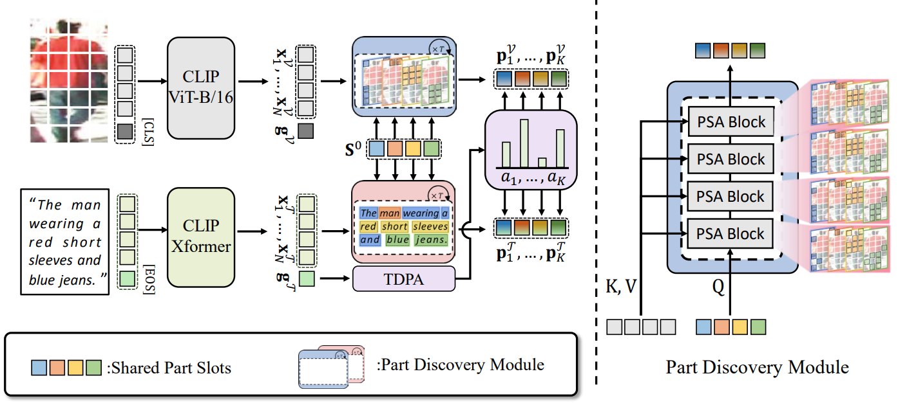

# PLOT: Text-based Person Search with Part Slot Attention for Corresponding Part Discovery



This repository is the official implementation of "[PLOT: Text-based Person Search with Part Slot Attention for Corresponding Part Discovery](https://arxiv.org/abs/2409.13475)" (ECCV 2024)

## Installation

  The code works on 
  - Ubuntu 22.04
  - CUDA 11.7.0
  - NVIDIA RTX A6000 / RTX 6000 Ada
  - Python: 3.10.13
  - PyTorch: 1.13.0

  Conda environment and pytorch installation:
  ```
  conda create -n PLOT python=3.10.13
  conda activate PLOT
  conda install pytorch==1.13.0 torchvision==0.14.0 torchaudio==0.13.0 pytorch-cuda=11.7 -c pytorch -c nvidia
  ```
  

  Additional package installation:
  ```
  pip install -r requirements.txt
  ```
